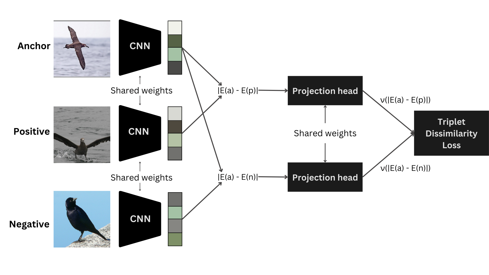

# Triplet dissimilarity: improving dissimilarity approaches through metric learning

This repository contains the scripts, notebooks, and trained models used in the paper presented at the INNS Workshop on Deep Learning Innovations and Applications (DLIA), co‑located with IJCNN 2025.

## Abstract

The dissimilarity representation describes each sample by its differences from other samples. Earlier work uses traditional metric distances, which have some limitations. Metric learning can improve this by learning a task-specific metric. We join the two ideas: a CNN backbone trained with triplet loss learns a task-specific dissimilarity function and feeds it to two representations: Triplet Dissimilarity Space (TDS), which measures every image against a set of prototypes, and Triplet Dissimilarity Vector (TDV), which turns each image-prototype pair into its own training point. We test on three fine-grained image datasets: CUB-200-2011 birds, Stanford Cars, and FGVC-Aircraft, using three embedding sizes and three clustering methods. TDV wins in every case, beating the best fixed-metric baselines by up to 0.4 percentage points and outscoring TDS by a larger gap. TDS beats the fixed space on only one dataset.

## Triplet dissimilarity



## Basic results

Highest accuracy (%) obtained by each method:

| Dataset      | TDS  | TDV      | Traditional dissimilarity space | Traditional dissimilarity vector |
| ------------ | ---- | -------- | ------------------------------- | -------------------------------- |
| **CUB**      | 82.4 | **83.2** | 82.7                            | 83                               |
| **Cars**     | 87.6 | **88.8** | 88.4                            | 88.7                             |
| **Aircraft** | 87.7 | **88.2** | 87.6                            | 87.8                             |

## Citation

```bibtex
@inproceedings{teixeira2025triplet,
  title={Triplet dissimilarity: improving dissimilarity approaches through metric learning},
  author={Teixeira, Lucas O. and Bertolini, Diego and Oliveira, Luiz E. S. and Cavalcanti, George D. C. and Costa, Yandre M. G.},
  booktitle={INNS Workshop on Deep Learning Innovations and Applications (DLIA)},
  year={2025}
}
```